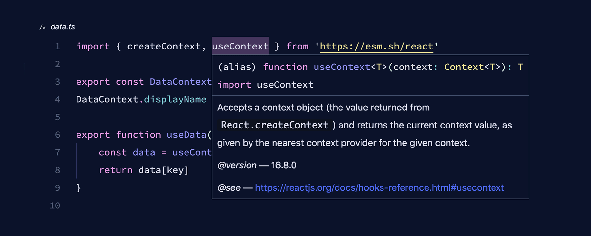

# ESM

A fast, global content delivery network for ES Modules. All modules are transformed to ESM by [esbuild](https://github.com/evanw/esbuild) in [npm](http://npmjs.org/).

## Import from URL
```javascript
import React from 'https://esm.sh/react'
```

### Specify version
```javascript
import React from 'https://esm.sh/react@17.0.1'
```

### Submodule
```javascript
import { renderToString } from 'https://esm.sh/react-dom/server'
```

### Specify ESM target
```javascript
import React from 'https://esm.sh/react?target=es2020'
```
Avaiable `target`: **es2015** - **es2020**, **esnext**

### Development mode
```javascript
import React from 'https://esm.sh/react?dev'
```

### External
```javascript
import React from 'https://esm.sh/postcss-flexbugs-fixes@5.0.1?external=postcss@8.1.6'
```

### Bundle mode
```javascript
import React from 'https://esm.sh/[react,react-dom]/react'
import ReactDom from 'https://esm.sh/[react,react-dom]/react-dom'
```
or your can define bundle list in the `import-map.json` ([import-maps proposal](https://github.com/WICG/import-maps))
```json
{
    "imports": {
        "https://esm.sh/": "https://esm.sh/[react,react-dom]/",
        ...
    }
}
```
```javascript
import React from 'https://esm.sh/react' // actual from 'https://esm.sh/[react,react-dom]/react'
```

⚠️ The bundling packages in URL are litmited up to **10**, to bundle more packages, please use the **esm** client(WIP).

<!-- ## Proxy mode
```javascript
import * from 'https://esm.sh/${provider}/name@version/path/to/file'
```
Avaiable `provider`: [deno.land](https://deno.land), [nest.land](https://nest.land), [x.nest.land](https://x.nest.land), [denopkg.com](https://denopkg.com)
<br>
Simply proxy all the providers in the `import-map.json`:
```json
{
    "imports": {
        "https://deno.land/":   "https://esm.sh/deno.land/",
        "https://nest.land/":   "https://esm.sh/nest.land/",
        "https://x.nest.land/": "https://esm.sh/x.nest.land/",
        "https://denopkg.com/": "https://esm.sh/denopkg.com/",
        ...
    }
}
``` -->

## Deno compatibility

**esm.sh** will polyfill the node internal modules(**fs**,**os**,etc) with [`https://deno.land/std/node`](https://deno.land/std/node) to support some modules to work in Deno, like `postcss`:

```javascript
import postcss from 'https://esm.sh/postcss'
import autoprefixer from 'https://esm.sh/autoprefixer'

const css = (await postcss([ autoprefixer]).process(`
    backdrop-filter: blur(5px);
    user-select: none;
`).async()).content
```

### X-Typescript-Types

By default, **esm.sh** will response a custom HTTP header of `X-TypeScript-Types` when the types(dts) defined, that is useful for deno types check ([link](https://deno.land/manual/getting_started/typescript#x-typescript-types-custom-header)).



You can pass the `no-check` query to disable the `types` header since some types are incorrect:

```javascript
import unescape from 'https://esm.sh/lodash/unescape?no-check'
```

## Caveats

Different with [Skypack](https://skypack.dev) and [jspm](https://jspm.org), **esm.sh** will bundle all dependencies(exclude peerDependencies) for each package, that means there may be redundant contents transmitted when you are importing multiple packages.<br>
This should be improved when the http/3(quic) is ready. For now the best practice is using the **bundle mode**.

## Network of esm.sh
- Main server in HK
- Global CDN by [Cloudflare](https://cloudflare.com)
- China CDN by [Aliyun](https://aliyun.com)

## Self-Hosting

You will need [Go](https://golang.org/dl) 1.14+ to compile the server, and ensure [supervisor](http://supervisord.org/) installed on your host machine.<br>
The server runtime will check the nodejs installation (12+) exists or install the latest LTS version automatically.

```bash
$ git clone https://github.com/postui/esm.sh
$ cd esm.sh
$ sh ./scripts/deploy.sh
```
